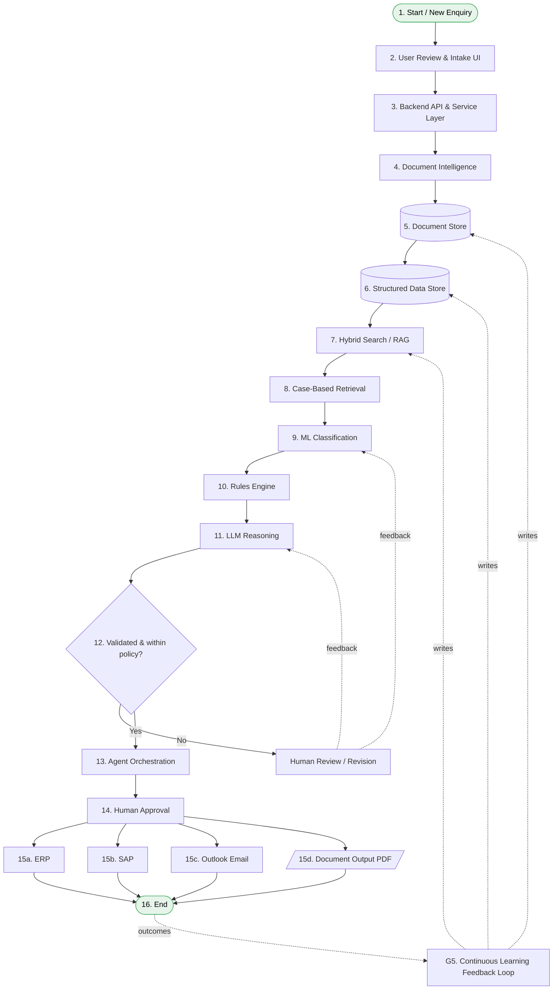

# Hybrid AI Presales Consultant — Standard Process Flow

> **Architectural pattern:** Hybrid Retrieval + Structured Data + Rules Engine + AI Reasoning + Human Approval

This document is a textual transcription of the source architecture diagram (`aries_flow.pdf`), intended to be consumed by a non-vision LLM. It enumerates every node, every edge, every phase, and every supporting service, with enough fidelity that the diagram can be reconstructed from this text alone.

---

## 1. System Overview

A pre-sales consulting workflow that ingests client enquiries from multiple channels, enriches them with document intelligence and historical context, runs them through a deterministic rules layer plus an LLM reasoning layer, gates the output through human approval, and finally executes downstream actions across ERP / SAP / Email / Document systems. A governance plane (identity, secrets, observability, BI) and a continuous-learning feedback loop sit underneath the whole thing.

The flow is divided into **5 phases** and contains **16 numbered process nodes**, **1 decision diamond**, **1 terminator (End)**, **5 governance components**, and **multiple sub-tools** within several nodes.

---

## 2. Phase Map (high level)

| Phase | Name | Numbered Nodes | Purpose |
|------:|------|----------------|---------|
| 1 | Input and Intake | 1, 2, 3 | Capture enquiries; expose intake UI; orchestrate via backend API |
| 2 | Data Preparation and Knowledge | 4, 5, 6, 7 | Parse docs; persist blobs and structured rows; expose hybrid search/RAG |
| 3 | AI and Decisioning | 8, 9, 10, 11, 12 (decision) | Retrieve cases; classify; apply rules; LLM reasoning; policy gate |
| 4 | Orchestration, Approval, and Execution | 13, 14, 15, 16 | Agent orchestration; human sign-off; execute on ERP/SAP/email/PDF |
| 5 | Governance and Continuous Improvement | (cross-cutting) | Identity, secrets, monitoring, BI, feedback loop |

---

## 3. Phase-by-Phase Detail

### Phase 1 — Input and Intake

**Node 1 — Start / New Enquiry** *(terminator / entry point)*
- **Channels (sub-components):**
  - Email / Outlook
  - WhatsApp
  - Phone
  - Web / ERP
- **Responsibility:** Client enquiries arrive from email, calls, WhatsApp, or ERP/web intake.

**Node 2 — User Review and Intake UI**
- **Tech (sub-components):**
  - React / Next.js
  - Microsoft Power Apps
- **Responsibility:** Operations team captures enquiry details and reviews AI suggestions.

**Node 3 — Backend API and Service Layer**
- **Tech (sub-components):**
  - FastAPI (Python)
  - .NET
- **Responsibility:** Handles APIs, business logic, security, and workflow orchestration.

---

### Phase 2 — Data Preparation and Knowledge

**Node 4 — Document Intelligence**
- **Tech / inputs (sub-components):**
  - Azure AI Document Intelligence
  - PDF
  - Excel
  - Email
- **Responsibility:** Extracts text, metadata, tables, and attachments from business documents.

**Node 5 — Document Store** *(data store)*
- **Tech (sub-components):**
  - Azure Blob Storage
  - Microsoft SharePoint
  - Azure Data Lake Storage Gen2 (ADLS Gen2)
- **Responsibility:** Stores proposals, reports, POs, invoices, certificates, and communication history.

**Node 6 — Structured Data Store** *(data store)*
- **Tech (sub-components):**
  - Azure SQL Database
  - PostgreSQL / Microsoft Dataverse
- **Responsibility:** Stores enquiry numbers, clients, industry, subdivision, cost, value, margin, and status.

**Node 7 — Hybrid Search / RAG**
- **Tech (sub-components):**
  - Azure AI Search
  - Semantic / Vector Search
  - Keyword Search
- **Responsibility:** Retrieves relevant past cases using semantic search, keyword search, filters, and reranking.

---

### Phase 3 — AI and Decisioning

**Node 8 — Case-Based Retrieval**
- **Responsibility:** Finds similar historical enquiries, quotations, scopes, and delivery outcomes.

**Node 9 — ML Classification**
- **Tech:** Azure ML
- **Responsibility:** Predicts scope category, subdivision, complexity, required documents, and resource profile.

**Node 10 — Rules Engine**
- **Responsibility:** Applies deterministic logic for pricing, margins, templates, tax, approval thresholds, and policy.

**Node 11 — LLM Reasoning**
- **Tech:** Azure OpenAI
- **Responsibility:** Drafts proposal scope, deliverables, assumptions, quotation narrative, and response emails.

**Node 12 — Decision: "Validated and within policy?"** *(diamond)*
- **`Yes` branch →** proceed to Phase 4 (Node 13 — Agent Orchestration).
- **`No` branch →** route to **Human Review / Revision** sub-flow:
  - **Human Review / Revision:** Review, revise, and refine outputs. Result is fed back upstream (feedback edge into Phase 3 / Phase 2).

---

### Phase 4 — Orchestration, Approval, and Execution

**Node 13 — Agent Orchestration**
- **Tech (sub-components):**
  - Azure AI Foundry Agent Service
  - Azure Functions
  - Azure Logic Apps
  - Microsoft Power Automate
- **Responsibility:** Coordinates tools, multistep workflows, document generation, and system actions.

**Node 14 — Human Approval**
- **Responsibility:** Approves technical scope, commercial accuracy, and client communication before release.

**Node 15 — Execution Systems** *(grouped container with 4 parallel sub-systems)*
- **Sub-component 15a — ERP:** Create enquiry record, assign enquiry number, update workflow.
- **Sub-component 15b — SAP:** Prepare sales order and transactional drafts.
- **Sub-component 15c — Outlook Email:** Send approved proposal and client updates.
- **Sub-component 15d — Document Output (PDF):** Generate proposal PDF, quote file, internal summary.

**Node 16 — End** *(terminator / exit point)*
- **State:** Proposal Issued and Systems Updated.

---

### Phase 5 — Governance and Continuous Improvement *(cross-cutting layer)*

These five components run underneath the entire pipeline and are not on the primary process flow path; they are wired in via dashed data/feedback edges.

- **G1 — Microsoft Entra ID:** Identity, RBAC, secure user access.
- **G2 — Azure Key Vault:** Secrets and credential protection.
- **G3 — Azure Monitor / Application Insights:** Monitoring, traces, audits, model behavior.
- **G4 — Power BI / Microsoft Fabric:** Dashboards, insights, margin and presales analytics.
- **G5 — Continuous Learning Feedback Loop:** New project data feeds back into document store, structured data, and retrieval (i.e. into Nodes 5, 6, 7).

---

## 4. Master Node Inventory (flat list)

This is every individual component/node on the diagram, including sub-components.

### 4.1 Numbered process nodes (16)
1. Start / New Enquiry
2. User Review and Intake UI
3. Backend API and Service Layer
4. Document Intelligence
5. Document Store *(data store)*
6. Structured Data Store *(data store)*
7. Hybrid Search / RAG
8. Case-Based Retrieval
9. ML Classification
10. Rules Engine
11. LLM Reasoning
12. **[Decision]** Validated and within policy?
13. Agent Orchestration
14. Human Approval
15. Execution Systems *(group of 4)*
16. End *(terminator)*

### 4.2 Off-path node (1)
- Human Review / Revision *(triggered on `No` from Node 12)*

### 4.3 Channel sub-components under Node 1 (4)
- Email / Outlook
- WhatsApp
- Phone
- Web / ERP

### 4.4 Tech sub-components under Node 2 (2)
- React / Next.js
- Power Apps

### 4.5 Tech sub-components under Node 3 (2)
- FastAPI
- .NET

### 4.6 Tech / input sub-components under Node 4 (4)
- Azure AI Document Intelligence
- PDF
- Excel
- Email

### 4.7 Tech sub-components under Node 5 (3)
- Azure Blob Storage
- SharePoint
- ADLS Gen2

### 4.8 Tech sub-components under Node 6 (2)
- Azure SQL Database
- PostgreSQL / Dataverse

### 4.9 Tech sub-components under Node 7 (3)
- Azure AI Search
- Semantic / Vector Search
- Keyword Search

### 4.10 Tech sub-components under Node 9 (1)
- Azure ML

### 4.11 Tech sub-components under Node 11 (1)
- Azure OpenAI

### 4.12 Tech sub-components under Node 13 (4)
- Azure AI Foundry Agent Service
- Azure Functions
- Logic Apps
- Power Automate

### 4.13 Sub-systems under Node 15 — Execution Systems (4)
- 15a. ERP
- 15b. SAP
- 15c. Outlook Email
- 15d. Document Output (PDF)

### 4.14 Phase 5 governance components (5)
- Microsoft Entra ID
- Azure Key Vault
- Azure Monitor / Application Insights
- Power BI / Microsoft Fabric
- Continuous Learning Feedback Loop

**Total individual elements:** 16 numbered nodes + 1 off-path node + 35 sub-components + 5 governance components = **57 elements**.

---

## 5. Edges / Flow Definitions

Three edge types are used in the source diagram:

- **`-->`  Solid arrow** — Primary Process Flow
- **`-.->` Green dashed arrow** — Data / Context Flow
- **`==>`  Blue dashed arrow** — Feedback Loop

### 5.1 Primary Process Flow (solid)
```
1  --> 2  --> 3
3  --> 4 (entry into Phase 2)
4  --> 5
5  --> 6
6  --> 7
7  --> 8 (entry into Phase 3)
8  --> 9
9  --> 10
10 --> 11
11 --> 12 [Decision]
12 -- Yes --> 13 (entry into Phase 4)
12 -- No  --> Human Review / Revision
13 --> 14
14 --> 15 (fan-out to 15a, 15b, 15c, 15d in parallel)
15 --> 16 (End)
```

### 5.2 Data / Context Flow (green dashed)
- **Node 4** ⇢ feeds extracted content into **Node 5** and **Node 6**.
- **Nodes 5, 6** ⇢ feed **Node 7 (Hybrid Search / RAG)**.
- **Node 7** ⇢ supplies retrieved context to **Node 8** and downstream Phase 3 reasoning.
- **Phase 3 nodes (8–11)** ⇢ pull supplemental structured data from **Node 6** as needed.

### 5.3 Feedback Loop (blue dashed)
- **Human Review / Revision** ⇢ feeds corrections back into **Phase 3** (Nodes 9–11) and into the **Document Store / Structured Store** for learning.
- **Phase 5 — Continuous Learning Feedback Loop (G5)** ⇢ writes outcomes from completed projects back into **Node 5 (Document Store)**, **Node 6 (Structured Data Store)**, and **Node 7 (Hybrid Search / RAG)**.

### 5.4 Cross-cutting governance edges
- **G1 (Entra ID)** wraps Nodes 2, 3, 13, 14 (anything user-facing or privileged).
- **G2 (Key Vault)** is consumed by Nodes 3, 4, 7, 9, 11, 13 (anything that holds secrets or calls external APIs).
- **G3 (Azure Monitor / App Insights)** observes all numbered nodes 2–15.
- **G4 (Power BI / Fabric)** reads from Node 6 and from monitoring telemetry.
- **G5 (Continuous Learning Feedback Loop)** writes into Nodes 5, 6, 7 (see 5.3).

---

## 6. Legend (verbatim from the diagram)

| Symbol | Meaning |
|---|---|
| Solid arrow `→` | Primary Process Flow |
| Green dashed arrow | Data / Context Flow |
| Blue dashed arrow | Feedback Loop |
| Cylinder | Data Store |
| Document icon | Document / Output |
| Diamond | Decision |
| Circle | Terminator |

Mapping back into the node inventory:
- **Data Store (cylinder):** Node 5, Node 6.
- **Document / Output:** Node 15d (Document Output / PDF).
- **Decision (diamond):** Node 12.
- **Terminator (circle):** Node 1 (Start), Node 16 (End).

---

## 7. Consolidated Tech Stack (by capability)

| Capability | Components |
|---|---|
| Frontend / UI | React, Next.js, Power Apps |
| Backend / API | FastAPI, .NET |
| Document parsing | Azure AI Document Intelligence |
| Object / file storage | Azure Blob Storage, SharePoint, ADLS Gen2 |
| Relational / structured storage | Azure SQL Database, PostgreSQL, Dataverse |
| Search / RAG | Azure AI Search (vector + keyword + semantic + reranking) |
| Classical ML | Azure ML |
| LLM | Azure OpenAI |
| Agent / workflow orchestration | Azure AI Foundry Agent Service, Azure Functions, Logic Apps, Power Automate |
| Downstream business systems | ERP, SAP, Outlook, PDF generation |
| Identity & access | Microsoft Entra ID |
| Secrets | Azure Key Vault |
| Observability | Azure Monitor, Application Insights |
| Analytics / BI | Power BI, Microsoft Fabric |
| Channels | Email/Outlook, WhatsApp, Phone, Web/ERP |

---

## 8. Mermaid Reconstruction (optional, for downstream rendering)



---

## 9. Implementation Notes for a Coding Agent

Useful invariants to preserve when generating code from this spec:

1. **Hybrid retrieval is mandatory.** Node 7 must combine vector + keyword + filter + rerank — not vector-only. Node 8 (case-based retrieval) is a downstream consumer of Node 7, not a replacement for it.
2. **Rules before LLM.** Node 10 (deterministic rules) runs *before* Node 11 (LLM). Pricing, margin, tax, and approval thresholds are never decided by the LLM alone.
3. **Two human gates.** Node 12 routes to *Human Review / Revision* on policy failure (correctness gate); Node 14 is a *Human Approval* before any external system is touched (release gate). Both must exist.
4. **Execution fan-out is parallel.** Nodes 15a–15d execute in parallel after Node 14 approval, not sequentially.
5. **Feedback writes are idempotent.** G5 writes back into Nodes 5, 6, 7 — design those writes to be replayable without duplicating training signal.
6. **Secrets never inline.** Anything calling Azure OpenAI, Azure AI Search, ERP, SAP, or Outlook must resolve credentials through G2 (Key Vault), not from env vars baked into images.
7. **All privileged actions go through Entra ID (G1).** Node 14 (Human Approval) and Node 13 (Agent Orchestration) in particular must enforce RBAC.
8. **Telemetry on every node 2–15.** G3 (Monitor / App Insights) should receive structured logs and traces from every numbered node except the terminators.
