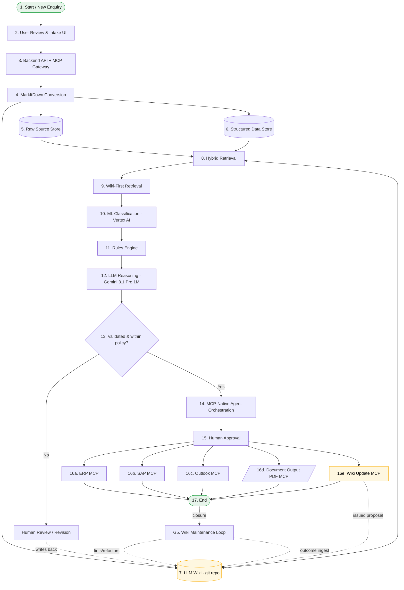

# Hybrid AI Presales Consultant — Standard Process Flow **v2**

> **Architectural pattern:** MarkItDown Ingestion + LLM Wiki (compounding) + MCP-Native Orchestration + Hybrid Retrieval + Rules Engine + Long-Context LLM Reasoning + Human Approval

This document is a textual transcription of the v2 architecture, intended to be consumed by a non-vision LLM. It is the successor to `aries_flow.md` (v1) and supersedes it where the two disagree. Where v1 stays correct, v2 keeps its node numbering compatible — but the **knowledge layer is fundamentally rebuilt** around an LLM-maintained wiki rather than naive RAG, the **orchestration layer is rebuilt** around MCP servers rather than Logic Apps / Power Automate glue, and the **AI backend is re-platformed** onto GCP (Gemini 3.1 Pro, Vertex AI Search, Vertex AI) while keeping every user-facing Microsoft surface (Outlook, Power Apps, SAP/ERP, Power BI, Entra ID) untouched, because clients run on Microsoft and that's not negotiable.

---

## 0. What changed from v1, and why

| Concern | v1 | v2 | Reason |
|---|---|---|---|
| Knowledge layer | RAG over chunked documents in Azure AI Search | **LLM Wiki** — a persistent, LLM-maintained markdown repo with `index.md` + `log.md` + entity/concept/source pages, augmented by retrieval | Karpathy-style: don't re-derive synthesis on every query; *compile once, maintain forever*. Wiki is a compounding artifact, not a stateless index. |
| Doc conversion | Azure AI Document Intelligence (closed, $$$, JSON output) | **MarkItDown** (Microsoft, OSS) primary + `markitdown-ocr` plugin with Gemini Vision for scanned pages; Azure DI kept only as fallback for hostile layouts | Markdown is what the Wiki and the LLM both speak natively. AzureDI's JSON forces a lossy reformat step. |
| LLM | Azure OpenAI (GPT-4o, ~128k context) | **Gemini 3.1 Pro** (1M context) — and with 1M context, *we can fit a wiki neighborhood + the source PDFs in-context directly*, dramatically reducing the importance of chunk-level retrieval | 1M ctx changes the retrieval calculus. Long context > clever chunking for most presales work. |
| Retrieval | Azure AI Search (vector + keyword + rerank) | **Vertex AI Search** + a local hybrid search (qmd-style BM25/vector over the wiki repo) | Personal preference — Vertex AI Search has been better in practice. Local search keeps the wiki self-contained. |
| Classical ML | Azure ML | **Vertex AI** (Custom Training + Endpoints) | Backend re-platforming. Same role. |
| Orchestration | Azure AI Foundry Agent Service + Azure Functions + Logic Apps + Power Automate | **MCP-Native Agent** (Claude Code / Gemini CLI / OpenCode pattern) calling **MCP servers** (one per external system: ERP, SAP, Outlook, Wiki, Search, Document Output) | MCP collapses four glue products into one protocol. The agent is a coding-agent-style file operator on the wiki repo, not an RPA flow. |
| Memory / state | Implicit in the search index | **Explicit, file-backed**: `index.md`, `log.md`, `AGENTS.md` schema, git history, plus per-conversation context files. Pattern borrowed from Claude Code's `CLAUDE.md` and Codex's `AGENTS.md`. | Memory becomes auditable and editable by humans. No vector-DB black box. |
| Continuous learning | "Feedback loop into document store" — vague | **Wiki Maintenance Loop** with named sub-agents (Ingest, Lint, Query, Outcome) and concrete ops: orphan detection, contradiction flagging, stale-claim sweeps, post-delivery outcome ingestion | Treat the wiki like a codebase. Lint it. Refactor it. Diff it. |
| User-facing surfaces | MS stack | **MS stack — unchanged.** Outlook, Power Apps, SAP, ERP, Power BI, Entra ID, SharePoint all stay. | Clients run on Microsoft. Don't fight that. |

**Net effect:** v2 is "Microsoft on the user side, Google + open-source on the AI side, MCP everywhere in between."

---

## 1. System Overview

A pre-sales consulting workflow that ingests client enquiries from multiple channels, converts every supporting document into clean markdown via MarkItDown, **integrates the new information into a persistent LLM-maintained Wiki** rather than just dumping it into a vector index, runs the resulting enquiry through a hybrid retrieval + classical ML + deterministic rules + long-context Gemini reasoning pipeline, gates the output through human approval, and finally executes downstream actions across ERP / SAP / Outlook / PDF systems via **MCP servers**. A governance plane (identity, secrets, observability, BI) and a **wiki maintenance loop** sit underneath.

The flow is divided into **5 phases** and contains **17 numbered process nodes**, **1 decision diamond**, **1 terminator (End)**, **5 governance components**, and **multiple sub-tools and MCP servers** within several nodes.

---

## 2. Phase Map (high level)

| Phase | Name | Numbered Nodes | Purpose |
|------:|------|----------------|---------|
| 1 | Input and Intake | 1, 2, 3 | Capture enquiries; intake UI; backend API + **MCP Gateway** |
| 2 | Knowledge Compilation | 4, 5, 6, 7, 8 | MarkItDown convert → raw store + structured store → **LLM Wiki** → hybrid retrieval |
| 3 | AI and Decisioning | 9, 10, 11, 12, 13 (decision) | Wiki-first retrieval; classify; rules; **Gemini 3.1 Pro reasoning**; policy gate |
| 4 | Orchestration, Approval, and Execution | 14, 15, 16, 17 | **MCP-native agent**; human sign-off; execute via per-system MCP servers |
| 5 | Governance and Wiki Maintenance | (cross-cutting) | Identity, secrets, monitoring, BI, **Wiki Maintenance Loop** |

---

## 3. Phase-by-Phase Detail

### Phase 1 — Input and Intake

**Node 1 — Start / New Enquiry** *(terminator / entry point)*
- **Channels (sub-components, unchanged from v1):**
  - Email / Outlook
  - WhatsApp
  - Phone
  - Web / ERP
- **Responsibility:** Client enquiries arrive from email, calls, WhatsApp, or ERP/web intake.

**Node 2 — User Review and Intake UI**
- **Tech (unchanged from v1):**
  - React / Next.js
  - Microsoft Power Apps
- **Responsibility:** Operations team captures enquiry details and reviews AI suggestions.

**Node 3 — Backend API, Service Layer, and MCP Gateway** *(expanded vs v1)*
- **Tech (sub-components):**
  - FastAPI (Python) — primary
  - .NET — kept for Microsoft-shop deployments
  - **MCP Gateway** *(NEW)* — central registry + auth proxy that exposes MCP servers (Wiki, Search, ERP, SAP, Outlook, Document Output, Vertex AI, Gemini) to internal agents. Handles tool discovery, scoping, rate limits, and credential brokering against Key Vault / Secret Manager.
- **Responsibility:** Handles APIs, business logic, security, workflow orchestration, **and MCP tool federation**.

---

### Phase 2 — Knowledge Compilation *(renamed from "Data Preparation and Knowledge")*

**Node 4 — Document Conversion (MarkItDown)** *(replaces Azure DI as primary)*
- **Tech (sub-components):**
  - **MarkItDown** (`pip install 'markitdown[all]'`) — primary. Converts PDF, DOCX, XLSX, PPTX, Outlook .msg, HTML, CSV, JSON, images, audio (incl. EXIF + transcription), zip archives. Output is clean markdown ready for the wiki.
  - **`markitdown-ocr` plugin with Gemini Vision** — used when MarkItDown encounters embedded images / scanned pages. Pass `llm_client=GeminiClient()`, `llm_model="gemini-3.1-pro"`. No new ML libraries needed.
  - **Azure AI Document Intelligence** — kept only as a fallback for hostile layouts (multi-column scanned forms with rotated tables, etc.) where MarkItDown underperforms.
- **Responsibility:** Convert every business document into clean, structured markdown. This is the single ingestion gateway; nothing reaches the wiki without passing through here.
- **Security note:** MarkItDown runs with the privileges of the host process. Per its own docs, prefer `convert_local()` over `convert()` for files that originate from disk; never call `convert()` on a URL supplied by an untrusted enquiry.

**Node 5 — Raw Source Store** *(data store, immutable)*
- **Tech (sub-components):**
  - **Google Cloud Storage** — primary, AI-pipeline side
  - **Azure Blob Storage** — mirror, for systems that already index against Azure
  - **SharePoint** — kept for client-deliverable artifacts (proposals, signed POs)
  - **ADLS Gen2** — only if the client demands it
- **Responsibility:** Immutable byte-level storage of every original source — proposals, reports, POs, invoices, certificates, communication history, recordings, attachments. **Never modified, only read.** This is the source of truth.

**Node 6 — Structured Data Store** *(data store)*
- **Tech (sub-components):**
  - **Cloud SQL (PostgreSQL)** — primary, AI-pipeline side
  - **BigQuery** — for analytics-scale historical pricing/margin data
  - **Azure SQL Database** — kept for ERP-side integration
  - **Microsoft Dataverse** — kept for Power Apps integration
- **Responsibility:** Stores enquiry numbers, clients, industry, subdivision, cost, value, margin, and status — i.e. the queryable rows. Lives alongside, not inside, the wiki.

**Node 7 — LLM Wiki** *(NEW — the centerpiece of v2)* *(data store + active artifact)*
- **What it is:** A git-versioned directory of LLM-generated markdown files that the system *incrementally builds and maintains*. Replaces the v1 idea of "throw chunks at a vector DB and re-derive synthesis on every query." The wiki is the persistent, compounding knowledge artifact.
- **Layout:**
  - `index.md` — content-oriented catalog of every wiki page with one-line summaries, organized by category (clients, projects, products, concepts, sources). Updated on every ingest. Read first by the agent on every query.
  - `log.md` — chronological append-only log: ingests, queries, lint passes. Convention `## [YYYY-MM-DD] ingest|query|lint | <title>` so it greps cleanly.
  - `AGENTS.md` (or `CLAUDE.md`) — schema document telling the agent how the wiki is structured, conventions, ingest workflow, query workflow, lint workflow. The "configuration file" that disciplines the agent.
  - `entities/` — one page per client, project, product, contact, supplier. Each page is updated whenever a new source mentions that entity.
  - `concepts/` — pricing patterns, margin policies, scope templates, regulatory rules, common technical configurations.
  - `sources/` — one summary page per ingested source, with citation back to the raw file in Node 5.
  - `outcomes/` — post-delivery learnings, what worked / didn't, fed in by the Outcome sub-agent (see Phase 5).
- **Storage:** A git repo. Every change is a commit. Every ingest is a PR-shaped diff. You get version history, branching, and blame for free.
- **Why this is better than RAG:** Cross-references already exist. Contradictions are already flagged. The synthesis already reflects everything ingested. You stop re-deriving; you start accumulating.

**Node 8 — Hybrid Retrieval (Wiki + Sources)** *(replaces v1 Node 7)*
- **Tech (sub-components):**
  - **Vertex AI Search** — managed hybrid search (vector + keyword + rerank) over both wiki pages and raw sources
  - **Local hybrid search** — `qmd`-style BM25 + vector + LLM rerank over the wiki repo, on-device, exposed via CLI and MCP
  - **Index-first navigation** — for many queries, reading `index.md` and following wiki-internal links beats vector search outright (especially with Gemini's 1M context — you can just *load the whole neighborhood*)
- **Responsibility:** Retrieves relevant past cases, entity pages, concept pages, and raw sources. Critically, the wiki is the *first* thing searched; raw sources are pulled in only when the wiki points to them.

---

### Phase 3 — AI and Decisioning

**Node 9 — Wiki-First Retrieval** *(replaces v1 Node 8 "Case-Based Retrieval")*
- **Responsibility:** Given an enquiry, the agent reads `index.md`, follows links to relevant entity pages (the client, similar products), concept pages (pricing patterns, scope templates), and source summaries (similar past quotations). With Gemini 1M context, often the entire relevant wiki neighborhood + a few raw source PDFs fit in one prompt — no chunk reassembly needed.

**Node 10 — ML Classification**
- **Tech:** **Vertex AI** (was Azure ML)
- **Responsibility:** Predicts scope category, subdivision, complexity, required documents, and resource profile.

**Node 11 — Rules Engine**
- **Responsibility (unchanged):** Applies deterministic logic for pricing, margins, templates, tax, approval thresholds, and policy. **Runs before the LLM. Always.**

**Node 12 — LLM Reasoning (Gemini 3.1 Pro)** *(replaces Azure OpenAI)*
- **Tech:** **Gemini 3.1 Pro** with **1M-token context window**
- **Responsibility:** Drafts proposal scope, deliverables, assumptions, quotation narrative, and response emails. Receives:
  1. The retrieved wiki neighborhood from Node 9
  2. The classifier outputs from Node 10
  3. The deterministic rule outputs from Node 11
  4. (Optionally) full raw source PDFs that the wiki pointed at
- **1M context implication:** Many problems that v1 solved with clever chunking now solve trivially by stuffing context. Reserve retrieval for the cases where the relevant universe genuinely doesn't fit.

**Node 13 — Decision: "Validated and within policy?"** *(diamond)*
- **`Yes` branch →** proceed to Phase 4 (Node 14 — MCP-Native Agent Orchestration).
- **`No` branch →** route to **Human Review / Revision**:
  - Reviewer corrects, refines, or rejects the draft.
  - **Important v2 addition:** the correction is *also written back into the wiki* (relevant concept page, entity page, or as a new outcome page). This is how the system actually learns — humans teach the wiki, not a model retraining run.

---

### Phase 4 — Orchestration, Approval, and Execution

**Node 14 — MCP-Native Agent Orchestration** *(major rewrite from v1 Node 13)*
- **Pattern:** A coding-agent-style runtime (Claude Code, Gemini CLI, OpenCode, or a custom equivalent built on an agent loop) operating on the wiki repo as its working directory and calling MCP servers as its tools.
- **Sub-agents (specialized agent loops):**
  - **Ingest Agent** — runs MarkItDown, writes source summary pages, updates entity pages, appends to `log.md`, updates `index.md`. One enquiry might touch 10–15 wiki pages.
  - **Query Agent** — answers a specific question against the wiki + raw sources; can file the answer back into the wiki as a new page if it's reusable.
  - **Drafting Agent** — produces the proposal draft (output of Phase 3) into a working file.
  - **Execute Agent** — once approved, fans out across MCP servers in Phase 4.
- **MCP Servers consumed (each one = a tool):**
  - **Wiki MCP** — read/write/search the wiki repo
  - **Search MCP** — Vertex AI Search + qmd-local
  - **ERP MCP** — create enquiry, assign number, update workflow
  - **SAP MCP** — prepare sales order, transactional drafts
  - **Outlook MCP** — send approved proposal email
  - **Document Output MCP** — generate proposal PDF, quote file, internal summary
  - **Vertex AI MCP** — call classifier endpoints
  - **Gemini MCP** — call Gemini 3.1 Pro with prompt + attached files
- **Why MCP and not Logic Apps:** One protocol replaces four glue products. Tools are versioned, discoverable, scoped, and individually testable. The agent's tool list is human-readable and lives in `AGENTS.md`.

**Node 15 — Human Approval**
- **Responsibility (unchanged):** Approves technical scope, commercial accuracy, and client communication before release. Two-person rule for high-value enquiries. Sign-off recorded in the wiki under the relevant project entity page.

**Node 16 — Execution Systems (via MCP)** *(grouped container, parallel fan-out)*
- **Sub-component 16a — ERP MCP server:** Create enquiry record, assign enquiry number, update workflow.
- **Sub-component 16b — SAP MCP server:** Prepare sales order and transactional drafts.
- **Sub-component 16c — Outlook MCP server:** Send approved proposal and client updates.
- **Sub-component 16d — Document Output MCP server:** Generate proposal PDF, quote file, internal summary.
- **Sub-component 16e — Wiki Update MCP server** *(NEW vs v1):* Write the issued proposal, final scope, and pricing back into the wiki — the `outcomes/` directory and the relevant entity/project pages. Closes the loop without a separate batch job.

**Node 17 — End** *(terminator)*
- **State:** Proposal Issued, Systems Updated, **and Wiki Updated.**

---

### Phase 5 — Governance and Wiki Maintenance *(cross-cutting layer)*

**G1 — Identity:**
- **Microsoft Entra ID** — primary, for human users (RBAC, SSO, Conditional Access)
- **Workload Identity Federation (GCP)** — for Entra-issued tokens to call GCP services without long-lived keys

**G2 — Secrets:**
- **Azure Key Vault** — Microsoft-side secrets (ERP creds, SAP creds, Outlook OAuth)
- **Google Secret Manager** — Gemini API, Vertex AI, GCS
- **MCP Gateway brokers all credential access** — agents never see raw secrets, only scoped MCP tool tokens

**G3 — Observability:**
- **OpenTelemetry** — instrumentation standard across FastAPI, MCP servers, and agent loops
- **Google Cloud Monitoring + Cloud Logging** — primary sink
- **Azure Monitor / Application Insights** — secondary sink, for correlation with Microsoft-side systems
- **Prompt + completion logging** — every Gemini call logged with input hash + token counts; redaction layer strips PII before persistence

**G4 — Analytics / BI:**
- **Power BI** — kept for client-facing dashboards (margins, presales conversion, SLA)
- **BigQuery + Looker Studio** — internal analytics, faster iteration on the AI-pipeline side
- **Microsoft Fabric** — kept for the Microsoft-shop deployments

**G5 — Wiki Maintenance Loop** *(replaces v1 "Continuous Learning Feedback Loop")*
- This is fundamentally different from v1. v1 implied a model retraining loop. v2's "learning" happens by *editing the wiki*.
- **Sub-loops:**
  - **Lint Agent** — periodic health-check pass: detect orphan pages with no inbound links, contradictions between pages, stale claims (newer source supersedes older claim), missing cross-references, concepts mentioned but lacking their own page, data gaps that justify a fresh web search. Output: a PR-shaped patch against the wiki.
  - **Outcome Ingestion** — when a project closes, post-delivery learnings (what worked, what didn't, actuals vs estimate) are written into `outcomes/` and propagated into the relevant concept and entity pages.
  - **Index/Log Maintenance** — `index.md` regenerated; `log.md` checked for chronological consistency.
  - **Schema Evolution** — `AGENTS.md` is itself a living document; the operator and agent co-evolve it as conventions change.
- **Writes into:** Node 5 (raw sources for new web-fetched material), Node 6 (structured store for new outcome rows), and **Node 7 (the Wiki itself — the dominant write path).**

---

## 4. Master Node Inventory (flat list)

This is every individual component/node on the diagram, including sub-components.

### 4.1 Numbered process nodes (17)
1. Start / New Enquiry
2. User Review and Intake UI
3. Backend API, Service Layer, and MCP Gateway
4. Document Conversion (MarkItDown)
5. Raw Source Store *(data store)*
6. Structured Data Store *(data store)*
7. **LLM Wiki** *(data store + active artifact — NEW)*
8. Hybrid Retrieval (Wiki + Sources)
9. Wiki-First Retrieval
10. ML Classification
11. Rules Engine
12. LLM Reasoning (Gemini 3.1 Pro)
13. **[Decision]** Validated and within policy?
14. MCP-Native Agent Orchestration
15. Human Approval
16. Execution Systems (via MCP) *(group of 5)*
17. End *(terminator)*

### 4.2 Off-path node (1)
- Human Review / Revision *(triggered on `No` from Node 13; writes corrections back into the Wiki)*

### 4.3 Channel sub-components under Node 1 (4)
- Email / Outlook
- WhatsApp
- Phone
- Web / ERP

### 4.4 Tech sub-components under Node 2 (2)
- React / Next.js
- Power Apps

### 4.5 Tech sub-components under Node 3 (3)
- FastAPI
- .NET
- **MCP Gateway** *(NEW)*

### 4.6 Tech sub-components under Node 4 (3)
- **MarkItDown** (primary)
- **markitdown-ocr + Gemini Vision** (OCR / images)
- Azure AI Document Intelligence (fallback)

### 4.7 Tech sub-components under Node 5 (4)
- Google Cloud Storage *(primary)*
- Azure Blob Storage *(mirror)*
- SharePoint
- ADLS Gen2

### 4.8 Tech sub-components under Node 6 (4)
- Cloud SQL (PostgreSQL) *(primary)*
- BigQuery
- Azure SQL Database
- Microsoft Dataverse

### 4.9 Sub-files under Node 7 — LLM Wiki (7)
- `index.md`
- `log.md`
- `AGENTS.md` (or `CLAUDE.md`) — schema/config
- `entities/`
- `concepts/`
- `sources/`
- `outcomes/`

### 4.10 Tech sub-components under Node 8 (3)
- Vertex AI Search
- qmd-style local BM25/vector search
- Index-first navigation (no engine, just `index.md`)

### 4.11 Tech sub-components under Node 10 (1)
- Vertex AI

### 4.12 Tech sub-components under Node 12 (1)
- Gemini 3.1 Pro (1M ctx)

### 4.13 Sub-agents under Node 14 (4)
- Ingest Agent
- Query Agent
- Drafting Agent
- Execute Agent

### 4.14 MCP servers consumed by Node 14 (8)
- Wiki MCP
- Search MCP
- ERP MCP
- SAP MCP
- Outlook MCP
- Document Output MCP
- Vertex AI MCP
- Gemini MCP

### 4.15 Sub-systems under Node 16 (5)
- 16a. ERP (via MCP)
- 16b. SAP (via MCP)
- 16c. Outlook Email (via MCP)
- 16d. Document Output / PDF (via MCP)
- 16e. **Wiki Update (via MCP)** *(NEW)*

### 4.16 Phase 5 governance components (5)
- G1 Identity (Entra ID + Workload Identity Federation)
- G2 Secrets (Key Vault + Secret Manager)
- G3 Observability (OpenTelemetry → Cloud Monitoring + App Insights)
- G4 Analytics / BI (Power BI + BigQuery + Looker Studio + Fabric)
- G5 **Wiki Maintenance Loop** (Lint, Outcome, Index/Log, Schema Evolution)

**Total individual elements:** 17 numbered nodes + 1 off-path + ~50 sub-components + 5 governance = **~73 elements**.

---

## 5. Edges / Flow Definitions

Three edge types, same legend as v1:

- **`-->`  Solid arrow** — Primary Process Flow
- **`-.->` Green dashed arrow** — Data / Context Flow
- **`==>`  Blue dashed arrow** — Feedback Loop

### 5.1 Primary Process Flow (solid)
```
1  --> 2  --> 3
3  --> 4 (entry into Phase 2)
4  --> 5 (raw bytes archived)
4  --> 6 (structured fields extracted)
4  --> 7 (markdown ingested into wiki)
5,6,7 --> 8 (retrieval surface)
8  --> 9 (entry into Phase 3)
9  --> 10
10 --> 11
11 --> 12
12 --> 13 [Decision]
13 -- Yes --> 14 (entry into Phase 4)
13 -- No  --> Human Review / Revision
14 --> 15
15 --> 16 (fan-out to 16a..16e in parallel)
16 --> 17 (End)
```

### 5.2 Data / Context Flow (green dashed)
- **Node 4 (MarkItDown)** ⇢ feeds normalized markdown into Nodes **5**, **6**, and **7** in parallel.
- **Node 7 (Wiki)** ⇢ is the *primary* source for retrieval at **Node 8** and direct context-loading at **Nodes 9 & 12**.
- **Nodes 5, 6** ⇢ feed Node 8 only when the wiki points at them.
- **Node 8** ⇢ supplies retrieved context to **Node 9** and downstream Phase 3 reasoning.
- **MCP Gateway (Node 3)** ⇢ brokers tool calls from Node 14 outward to Nodes 16a–16e and to external Gemini / Vertex services.

### 5.3 Feedback Loop (blue dashed) — *much richer than v1*
- **Human Review / Revision** ⇢ writes corrections into **Node 7 (Wiki)** — specifically into relevant entity, concept, and outcome pages. *This is the system's primary learning channel.*
- **Node 16e (Wiki Update MCP)** ⇢ writes issued proposals and final scope/pricing back into Node 7 immediately on approval.
- **G5 — Wiki Maintenance Loop** ⇢ continuously rewrites Node 7 and occasionally writes into Nodes 5, 6 (web-fetched sources, new outcome rows).
- **Outcome Ingestion** (post-delivery) ⇢ writes into `outcomes/` in Node 7.

### 5.4 Cross-cutting governance edges
- **G1 (Identity)** wraps Nodes 2, 3, 14, 15.
- **G2 (Secrets)** is consumed by Nodes 3, 4, 8, 10, 12, 14, 16a–16e — and is *only* reached through the MCP Gateway in Node 3, never directly.
- **G3 (Observability)** observes all numbered nodes 2–16.
- **G4 (BI)** reads from Node 6 (structured store) and from monitoring telemetry.
- **G5 (Wiki Maintenance Loop)** writes into Nodes 5, 6, 7 (see 5.3); Node 7 is the dominant write path.

---

## 6. Legend (unchanged from v1)

| Symbol | Meaning |
|---|---|
| Solid arrow `→` | Primary Process Flow |
| Green dashed arrow | Data / Context Flow |
| Blue dashed arrow | Feedback Loop |
| Cylinder | Data Store |
| Document icon | Document / Output |
| Diamond | Decision |
| Circle | Terminator |

Mapping into v2's inventory:
- **Data Store (cylinder):** Node 5, Node 6, **Node 7 (Wiki)** *(yes, the wiki is also a store, even though it's an active artifact)*.
- **Document / Output:** Node 16d (PDF generation).
- **Decision (diamond):** Node 13.
- **Terminator (circle):** Node 1 (Start), Node 17 (End).

---

## 7. Consolidated Tech Stack (by capability, v2)

| Capability | v1 | v2 |
|---|---|---|
| Frontend / UI | React, Next.js, Power Apps | **Same** |
| Backend / API | FastAPI, .NET | **+ MCP Gateway** |
| Document parsing | Azure AI Document Intelligence | **MarkItDown** primary; markitdown-ocr + Gemini Vision; Azure DI fallback |
| Object / file storage | Azure Blob, SharePoint, ADLS Gen2 | **+ Google Cloud Storage** (primary AI side) |
| Relational / structured | Azure SQL, PostgreSQL/Dataverse | **+ Cloud SQL, + BigQuery** |
| **Knowledge layer** | Azure AI Search (RAG over chunks) | **LLM Wiki (git repo of markdown)** + **Vertex AI Search** + qmd-local |
| Classical ML | Azure ML | **Vertex AI** |
| LLM | Azure OpenAI | **Gemini 3.1 Pro (1M ctx)** |
| Orchestration | AI Foundry Agent + Functions + Logic Apps + Power Automate | **MCP-native agent (Claude Code / Gemini CLI / OpenCode pattern) + 8 MCP servers** |
| Downstream business systems | ERP, SAP, Outlook, PDF | **Same surfaces, all wrapped as MCP servers** |
| Identity & access | Entra ID | **Entra ID + Workload Identity Federation (GCP)** |
| Secrets | Key Vault | **+ Google Secret Manager**, brokered by MCP Gateway |
| Observability | Azure Monitor, App Insights | **OpenTelemetry → Cloud Monitoring + App Insights** |
| Analytics / BI | Power BI, Microsoft Fabric | **+ BigQuery + Looker Studio** |
| Channels | Outlook, WhatsApp, Phone, Web/ERP | **Same** (user-side untouched) |
| **Continuous learning** | Vague "feedback loop" | **Wiki Maintenance Loop** (Lint, Outcome, Index/Log, Schema Evolution) — concrete sub-agents and ops |

---

## 8. Mermaid Reconstruction



---

## 9. Implementation Notes for a Coding Agent

Useful invariants to preserve when generating code from this spec.

**Knowledge / Wiki**
1. **The wiki is the source of derived truth.** If a piece of synthesis exists in the wiki, prefer it over re-deriving from raw sources. Re-derivation is allowed but should result in either a confirmation of existing wiki content or a PR against it.
2. **Every ingest is a diff.** Use git. One enquiry → one branch / one commit. The diff is auditable and revertible.
3. **`index.md` is read on every query.** It is the agent's mental model of what the wiki contains. Keep it under the agent's working context budget.
4. **`AGENTS.md` is the agent's constitution.** Version it. When you change a convention, update `AGENTS.md` first, the wiki second.
5. **Don't fight long context.** If the relevant wiki neighborhood + 3 source PDFs fit in 1M tokens, just load them. Reserve clever retrieval for the cases where they don't.

**MCP**
6. **One MCP server per external system.** Don't multiplex. ERP MCP and SAP MCP stay separate even if the same team ships both.
7. **MCP Gateway brokers credentials.** Agents never see raw secrets. Tools receive scoped, short-lived tokens.
8. **MCP tools are versioned.** A breaking change in the ERP MCP is a new tool name, not a silent change to an existing one. Old prompts still work.

**Hard rules from v1 that still apply**
9. **Rules before LLM.** Node 11 (deterministic rules) runs before Node 12 (Gemini). Pricing, margin, tax, approval thresholds are never decided by the LLM alone.
10. **Two human gates.** Node 13 routes to Human Review on policy failure (correctness gate); Node 15 is Human Approval before any external system is touched (release gate). Both must exist.
11. **Execution fan-out is parallel.** Nodes 16a–16e execute in parallel after Node 15 approval, not sequentially.
12. **Telemetry on every node 2–16.** OpenTelemetry traces span agent loops, MCP calls, and external system calls.

**v2-specific**
13. **MarkItDown runs sandboxed.** Per its own security note, treat it like `open()` — never feed it untrusted URLs without a fetch wrapper. Prefer `convert_local()`.
14. **Wiki writes are append-or-merge, not overwrite-without-trace.** Even the Lint Agent's "stale claim sweep" should leave a brief note in the relevant page's history, not silently delete.
15. **Feedback writes are idempotent.** Replaying the Outcome Ingestion for a closed project should be safe.

---

## 10. Migration Notes from v1

If you have a running v1 system, the migration order that minimizes risk:

1. **Stand up MarkItDown alongside Azure DI** and dual-write for a month. Compare outputs. Cut over per-document-type as confidence grows (DOCX/XLSX/PPTX/email cut over fast; complex scanned PDFs last).
2. **Boot the LLM Wiki empty**, then back-fill by re-ingesting the last 12 months of enquiries through MarkItDown → Wiki. This seeds entity and concept pages with real density before going live.
3. **Wrap each existing system as an MCP server** before ripping out Logic Apps. Run them in parallel. Cut traffic over per-system.
4. **Shadow-run Gemini 3.1 Pro alongside Azure OpenAI** on Node 12 for two weeks. Compare drafts. Switch primary when human-approval rates match or exceed.
5. **Vertex AI Search**: index the wiki first, raw sources second. Keep Azure AI Search live until Vertex retrieval recall@k is non-inferior.
6. **Power BI / Microsoft Fabric stay** for client-facing dashboards forever. Add BigQuery + Looker Studio internally, don't replace.
7. **The Wiki Maintenance Loop is opt-in to start.** Run the Lint Agent in dry-run mode for the first month — it produces PRs against the wiki, a human approves them. Move to auto-merge for low-risk rules later.

---

*End of v2 spec. Companion artifact: `aries_flow_v2.pdf` (visual flow, same style as v1).*
